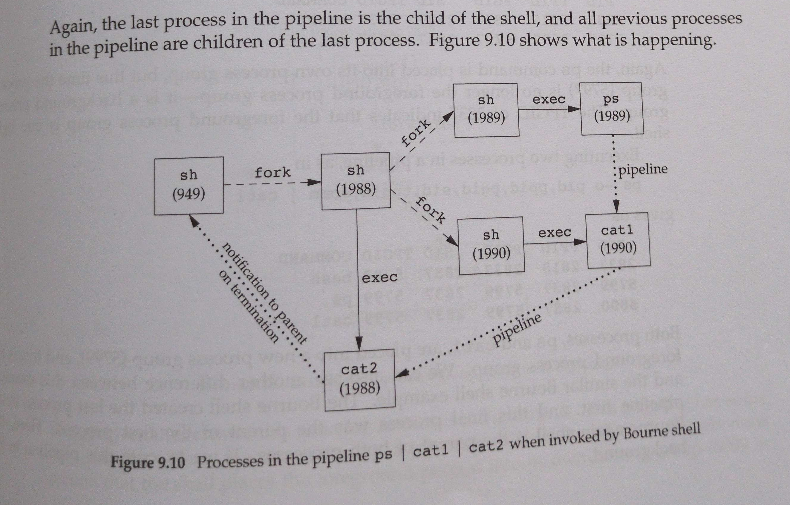

# Lab 1 Report
*Authors: Nils Henry Janken Strömgren, Tony Bao Le and Niklas Leander Luca Timpe*
## Have you met all the specifications outlined for the lab?
Yes, the following specifications were succesfully implemented in our shell program:
<!-- Explain what it means to reach the specifications? -->
- Ctrl-D Handling

- Basic Commands

- Background Execution

- Piping

- I/O Redirection

- Built-ins

- Ctrl-C Handling

- No Zombies

### In which order?
We approached the implementation of the specifications in a slightly different order than outlined in the design document.

Running single arguments using the `execvp()` function was implemented first. Using `execvp()` instead of `execl`, `execlp`, `execle`, `execv`, `execve` or `execve`. The letter *v* means arguments are passed as a vector (argv[]), which is the same type as the parse.c stores the pgmList. The letter p means that the function uses takes a filename argument and uses the PATH environment variable to find the executable file as opposed to we having to supply the PATH environment. 

From here we added the ability to I/O redirect from `STDOUT` and `STDIN`, with a simple check in our command structure to see if the user had specified an input `<` or output `>` redirection. For output redirection, we used the `open()` system call with the flags `O_WRONLY | O_CREAT | O_TRUNC` to either create or overwrite the target file. The returned fd was then duplicated onto `STDOUT_FILENO` using `dup2()`. This replaced the child process's standard output with the file, so any `printf()` or write calles in the executed program would go into the file instead of the terminal.

After redirects, work began on blocking `Ctrl+C` in the foreground thread using a signal handler, while still allowing background processes to exit. This part was important because the default behavior of `SIGINT` (the signal sent by pressing `Ctrl+C`) is to terminate the entire process group, this would kill not only the running foreground command but also the shell itself if they share the same process grou. Since one of the specifications requres that the shell must not terminate on `Ctrl+C`, we had to carefully examine the handlings of signals between the shell process and its children processes.

To achieve this, we first ensured that our shell process ignored `SIGINT` by installing a custom signal handler `sigint_handler` in this parent. This ensured that pressing `Ctrl+C` would no longer kill the shell itself. This meant that children had to have their interuption reenabled when killing foreground child processes such as sleep 30 with `Ctrl+C`. Therefore, we used `tcsetpgrp()` system call to change the foreground process group of the terminal. This means that we can hand over terminal control to the process group running the foreground job. Once a process group is in the foreground, it alone receives terminal generated `SIGINT` signal. By placing each foreground job into its own process group and then calling `tcsetpgrp()` to transfer terminal control to that group, we made sure that pressing `Ctrl + C` would terminate ony the currently running command, while the shell itself and any other background jobs were not affected.

Without process groups, all processes spawned by the shell would share the same group and pressing ```Ctrl+C``` would just kill everything, including background jobs or even the shell itself. By making the parent (our shell) its own process group leader and dynamically giving control to child process groups only when they run in the foreground, we could implement the correct expected job control behavior. 

`Ctrl+D` was implemented in the foreground process, by placing our parent process into its own process group. Detecting `Ctrl+D` is different from detecting `Ctrl+C`, since no signal is generated. Instead, `Ctrl+D` tells the terminal driver to send and end of file (EOF) marker to theprogram that is reading input rigght now. In our shell, we used the `readline()` function, which returns `NULL` when EOF is reached. This gave us a clean way to check if the user pressed `Ctrl+D`instead of entering a new command. 

Once we detect EOF, the shell terminates, but it needs to terminate gracefully. This means releasing any resources, making sure no background processes are left in a zombie state, and returning control to the terminal. If we did not handle this well, the shell would either enter an inifnite loop where it constantly waits for input that never arrives or it behaves unpredictably. So when we check for `NULL`and exit the main loop, we made sure that the shell exits in the same way as standard shells.

Pipes were implemented last using `pipe()`, `dup2()`, `close()`.

## What challenges did you encounter in meeting each specification?
It went pretty smooth for the most part, as the `Command` data structure stored and parsed a lot of the necessary data into easily extractable formats.

We had some issues with the auto tests and colored writes to the terminal, which made all tests fail. After removing colored writes, all tests except piping related tests succedded.

Initially we didn't know about the different exec command types and implemented our own absolute PATH lookup. This obviously got removed immediately after we found out about `exec[p]`, which allowed us to skip the PATH lookup.

For some of us, C knowledge was quite rusty because th the majority of us do not primarily work with C. Two of us usually work with scripting languages and the other works with Rust which is kind of similar. This lead to some struggles with remembering memory management and interacting with data structures, primarily lists.

Perhaps, approaching the implementation of functionality in a similar order as outlined in the specification document would have been more efficient. Implementing piping before I/O redirection, built-ins, and `ctrl+C` handling could have led to a more simple and focused approach to pipes.

Regarding pipes, we struggled with the order of how to open and close our pipes. Was also confusing on if we should start children from left-hand-side or right-hand-side. We decided with going from right-hand-side to left-hand-side. This was inspired by the implementation outlined in the book *Advanced Programming in the UNIX Environment* where it is suggested that the first typed command should be exec'ed in the first fork, after it has forked processes for the subsequent commands. Thats why we fork once and then fork again for command  in the `pgmlist` with increasing order (which is in reverse). This makes the last command in the list the first command typed into the shell, which then will be execed in the first fork. This was implemented in an iterative way, traversing the `next` element. A recursive approach was also briefly considered, but the iterative approach was clear and concise enough.



Although debugging was helpful in determining the order of operations of piping. It was difficult tracking the forked processes, and determining wether the read or write-end of pipes were correctly written to.

## Do you have any feedback for improving the lab materials?
We think the lab material was quite good. The only feedback is that 1300 words may be a little bit too many words and we might have had to add unncessary fluff just to make the report fulfill the 1300 word requirement

### Did you find the automated tests useful?
Yes, the automated tests were useful, although we encountered some issues when placing our shell into its own process group and making it the leader, as certain tests no longer functioned as expected. For most of the development process, we relied on manual testing by directly interacting with the shell, and then used the automated tests at the end as a final validation step to ensure correctness.

One particular test, which evaluates the handling of `SIGINT` in a child process, revealed a race condition: the signal was delivered faster than our initial implementation could update the handler. This made us aware of the importance of minimizing race conditions, for example by configuring signal handling before forking a child process. To address this, we implemented a signal handler that manages signals under specific conditions and ensured that `tcsetpgrp` was invoked in both the child and parent processes, preventing forks from making assumptions about process states that are not guaranteed.


